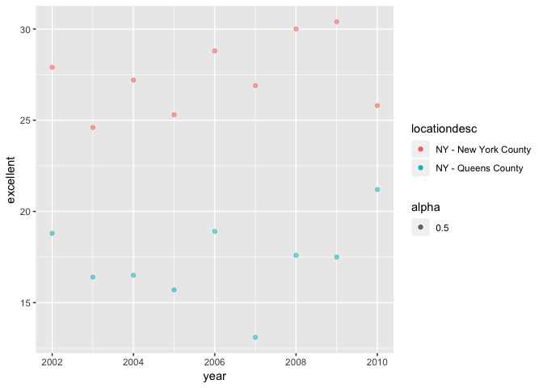

Homework 2
================
Annie Yu
10/4/2018

Problem 1:
==========

Read and clean the data; retain line, station, name, station latitude / longitude, routes served, entry, vending, entrance type, and ADA compliance. Convert the entry variable from character (YES vs NO) to a logical variable

``` r
NYC_transit = read_csv(file = "/Users/annie/Desktop/data science/Homework/Homework_2/NYC_Transit_Subway_Entrance_And_Exit_Data.csv") %>% 
janitor::clean_names() %>% 
select(line, station_name, station_latitude, station_longitude, starts_with("route"), entry, vending, entrance_type, ada) %>% 
mutate(entry = recode(entry, 'YES' = T, 'NO' = F)) 
```

    ## Parsed with column specification:
    ## cols(
    ##   .default = col_character(),
    ##   `Station Latitude` = col_double(),
    ##   `Station Longitude` = col_double(),
    ##   Route8 = col_integer(),
    ##   Route9 = col_integer(),
    ##   Route10 = col_integer(),
    ##   Route11 = col_integer(),
    ##   ADA = col_logical(),
    ##   `Free Crossover` = col_logical(),
    ##   `Entrance Latitude` = col_double(),
    ##   `Entrance Longitude` = col_double()
    ## )

    ## See spec(...) for full column specifications.

``` r
dim(NYC_transit)
```

    ## [1] 1868   19

For problem 1, the dataset contains line, station\_name, station\_latitude, station\_longitude, route1, route2, route3, route4, route5, route6, route7, route8, route9, route10, route11, entry, vending, entrance\_type, ada variables. In orginal data, there are 32 variables. After data cleaning, there are 19 varibales for now dataset. Now the dataset is stored in the dataframe, which has 1868 rows and 19 columns. And the new dataset is not tidy. Becasue the route1 to route11 are spread.

How many distinct stations are there?
-------------------------------------

``` r
NYC_transit %>%
 distinct(station_name, line) %>% 
 nrow()
```

    ## [1] 465

There are 465 stations in there.

How many stations are ADA compliant?
------------------------------------

``` r
NYC_transit %>% 
  filter(ada == T) %>% 
  distinct(station_name, line) %>% 
  nrow()
```

    ## [1] 84

There are 84 stations, which are ADA compliants.

The proportion of station entrances / exits without vending allow entrance
--------------------------------------------------------------------------

``` r
nrow(NYC_transit %>% filter(entry== T&vending == "NO"))/nrow(NYC_transit %>%  filter(vending =="NO"))
```

    ## [1] 0.3770492

In all entrances / exits without vending, the proportion of that allow entrance is 0.377

Reformat data so that route number and route name are distinct variables. How many distinct stations serve the A train?
-----------------------------------------------------------------------------------------------------------------------

``` r
NYC_transit %>% 
  gather(key = route_number, value = route_name, route1:route11) %>% 
  filter(route_name == 'A') %>% 
  distinct(station_name, line) %>% 
  nrow()
```

    ## [1] 60

After reformating the data, there are 60 stations serve the A train.

Of the stations that serve the A train, how many are ADA compliant?
-------------------------------------------------------------------

``` r
NYC_transit %>% 
  gather(key = route_number, value = route_name, route1:route11) %>%
  filter(route_name == 'A', ada == T) %>% 
  distinct(station_name, line) %>% 
  nrow()
```

    ## [1] 17

Of the stations that serve the A strain, there are 17 ADA compliant.

Problem 2:
==========

Read and clean the Mr. Trash Wheel sheet:
-----------------------------------------

``` r
Trash_wheel_data = readxl::read_xlsx("/Users/annie/Desktop/data science/Homework/Homework_2/HealthyHarborWaterWheelTotals2018-7-28.xlsx", range = 'A2:N338') %>%  
janitor::clean_names() %>% 
filter(!dumpster == "NA") %>% 
mutate(sports_balls = as.integer(round(sports_balls,0)))
```

Read and clean precipitation data for 2016 and 2017
---------------------------------------------------

``` r
prec_2017 =  readxl::read_xlsx("/Users/annie/Desktop/data science/Homework/Homework_2/HealthyHarborWaterWheelTotals2018-7-28.xlsx", sheet = 4, range = 'A2:B15') %>% 
  mutate(year = 'rep(2017,13)') 
```

``` r
prec_2016 =  readxl::read_xlsx("/Users/annie/Desktop/data science/Homework/Homework_2/HealthyHarborWaterWheelTotals2018-7-28.xlsx", sheet = 5, range = 'A2:B15') %>% 
  mutate(year = 'rep(2016,13)') 
```

``` r
prefull = rbind(prec_2017,prec_2016) %>% 
  mutate(month = as.factor(Month)) 
  levels(prefull$month) = month.name
  prefull
```

    ## # A tibble: 26 x 4
    ##    Month Total year         month    
    ##    <dbl> <dbl> <chr>        <fct>    
    ##  1     1  2.34 rep(2017,13) January  
    ##  2     2  1.46 rep(2017,13) February 
    ##  3     3  3.57 rep(2017,13) March    
    ##  4     4  3.99 rep(2017,13) April    
    ##  5     5  5.64 rep(2017,13) May      
    ##  6     6  1.4  rep(2017,13) June     
    ##  7     7  7.09 rep(2017,13) July     
    ##  8     8  4.44 rep(2017,13) August   
    ##  9     9  1.95 rep(2017,13) September
    ## 10    10  0    rep(2017,13) October  
    ## # ... with 16 more rows

The Trash\_wheel dataset contains 285 rows and 14 columns, and the dataset contains dumpster, month, year, date, weight\_tons, volume\_cubic\_yards, plastic\_bottles, polystyrene, cigarette\_butts, glass\_bottles, grocery\_bags, chip\_bags, sports\_balls, homes\_powered varibales. After reading and cleaning precipitation data for 2016 and 2017, it contains 26 rows and 4 columns, the dataset contains Month, Total, year, month varibales. In the dataset of Mr. Trash Wheel, I choose the dumpster1, which has 4.31 tons and 18 cubic yards,as the example. On the 05/16/14, there are 1450 plastic bottles, 1820 polysyrene, 126000 cigarette butts, 72 glass bottles, 584 grocery bags, 1162 chip bages and 7 sports balls. The precipiation in 2017 is 32.93. The median number of sports balls in a dumspter in 2016 is 26.

Problem 3
=========

``` r
library(p8105.datasets)
data(brfss_smart2010)
```

Format the data to use appropriate variable names; Focus on the “Overall Health” topic Exclude variables for class, topic, question, sample size, and everything from lower confidence limit to GeoLocation Structure data so that values for Response (“Excellent” to “Poor”) are column names / variables which indicate the proportion of subjects with each response (which are values of Data\_value in the original dataset) Create a new variable showing the proportion of responses that were “Excellent” or “Very Good”

``` r
brfss =
  brfss_smart2010 %>% 
  janitor::clean_names() %>%
  filter(topic == "Overall Health") %>% 
  select(-class, -topic, -question, -sample_size, -(confidence_limit_low:geo_location)) %>% 
  spread(key = response, value = data_value) %>% 
  janitor::clean_names() %>%
  mutate(proportion = (excellent + very_good)/ (excellent + very_good + good + fair + poor))
```

How many unique locations are included in the dataset?
------------------------------------------------------

``` r
brfss_smart2010 %>% 
distinct(Locationdesc) %>% 
nrow()
```

    ## [1] 404

There are 404 unique locations are included in the dataset

How many state are included in the dataset and What state is observed the most?
-------------------------------------------------------------------------------

``` r
brfss_smart2010 %>%
distinct(Locationabbr) %>% 
nrow()
```

    ## [1] 51

``` r
tail(names(sort(table(brfss_smart2010$Locationabbr))),1)
```

    ## [1] "NJ"

There are 50 state and 1 DC included in the dataset, and the 'NJ' is the most observed.

In 2002, what is the median of the “Excellent” response value?
--------------------------------------------------------------

``` r
df_2002 = brfss %>%
  filter(year == '2002')
median(df_2002$excellent, na.rm = TRUE)
```

    ## [1] 23.6

The median of the "Excellent" response value is 23.6

Make a histogram of “Excellent” response values in the year 2002.
-----------------------------------------------------------------

``` r
ggplot(filter(brfss, year == 2002),
       aes(x = excellent)) +
         geom_histogram() +
  labs(
    title = "The histogram of “Excellent” response values in the year 2002"
  )
```

    ## `stat_bin()` using `bins = 30`. Pick better value with `binwidth`.

    ## Warning: Removed 2 rows containing non-finite values (stat_bin).


Make a scatterplot showing the proportion of “Excellent” response values in New York County and Queens County (both in NY State) in each year from 2002 to 2010.
----------------------------------------------------------------------------------------------------------------------------------------------------------------

``` r
ggplot(filter(brfss, locationdesc == "NY - New York County"| locationdesc == "NY - Queens County"), aes(x = year, y = excellent))+
  geom_point(aes(color= locationdesc, alpha = 0.5)) +
  labs(
    title = "The proportion of “Excellent” response values in New York County and Queens County in each year from 2002 to 2010"
  )
```


